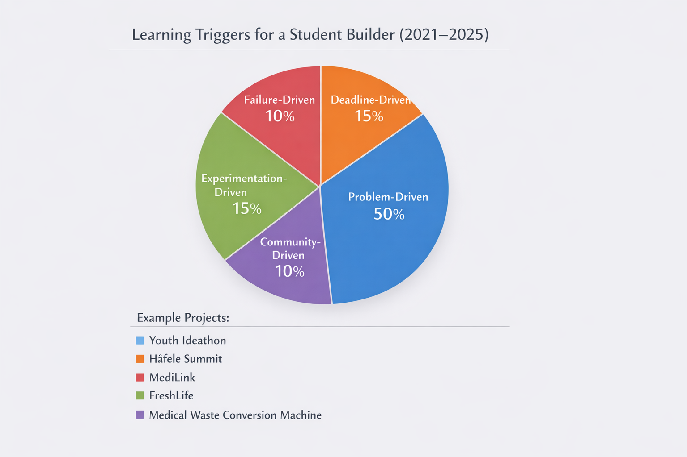
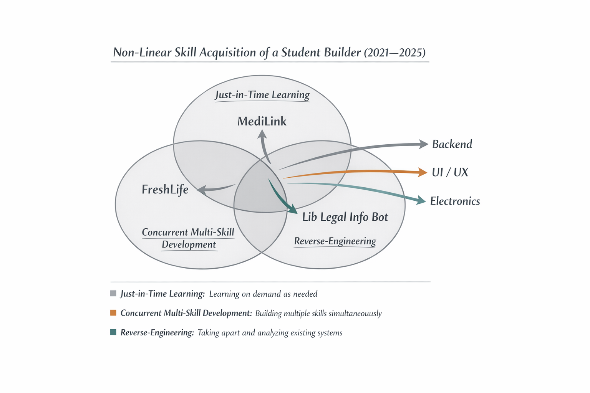
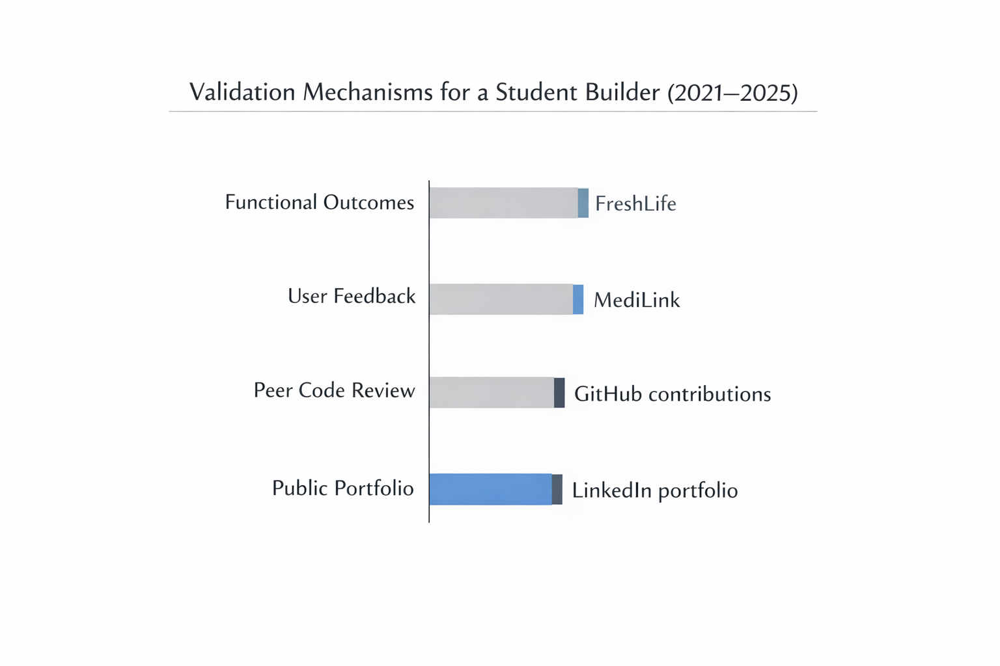
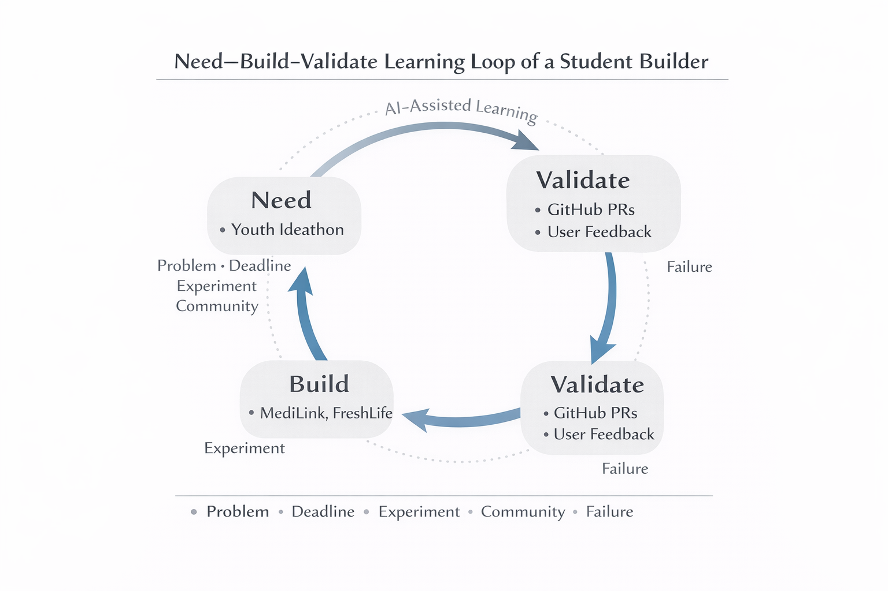
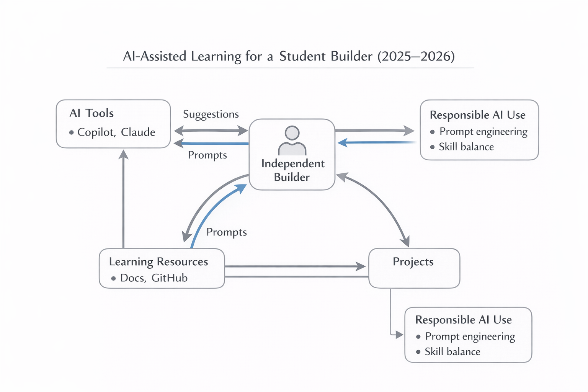

# Learning Without Curriculum: How Students Learn Technical Skills Outside Formal Education

**Author:** Ruthwik Reddy  
**Affiliation:** Independent Student Researcher  
**Year:** 2026

## Abstract

Formal education tells us that the best way to learn technical skills is through a set curriculum, with a clear, linear path and standardized tests. But I've noticed that many of us who build things—especially in tech—learn complex skills on our own, driven by the problems we want to solve. This paper is my own story, an auto-ethnographic look at how I, a student builder, have constructed, sequenced, and validated my technical skills without any formal curriculum. Looking at my projects, code repositories, and personal notes, I've identified the patterns and triggers that pushed me to learn. The core of my findings is a "Need–Build–Validate" loop, a cycle where a real-world need forces me to build something, and in building it, I validate my new skills. This process is heavily shaped by modern tools, and I make sure to include AI-assisted learning as a key part of my study, which makes it feel new and relevant. My hope is that this model can offer a fresh perspective on how we design education, think about credentials, and support learners in a world with AI.

---

## 1. Introduction

Curriculum-based education remains the dominant framework for teaching technical skills in schools and universities. These systems emphasize predefined learning outcomes, linear topic sequencing, and assessment through examinations or grades. While effective for standardized instruction, such models often fail to account for learners who acquire skills through real-world problem solving, project execution, and iterative failure outside formal classrooms.

In recent years, the rise of accessible online documentation, open-source ecosystems, and AI-assisted learning tools has enabled students to bypass traditional instructional pathways entirely (Gkikas & Tsolis, 2025). Many student builders now learn programming, system design, and product development not because a syllabus requires it, but because a real problem demands it. Despite the visibility of this phenomenon, academic literature has largely focused on structured self-learning platforms (Chen, Xie, & Hwang, 2023) or maker education programs, rather than deeply examining independent, curriculum-free learning trajectories.

This paper addresses that gap by asking: **How do independent student builders construct and validate technical skills without a formal curriculum?** By grounding the analysis in lived experience rather than abstract theory, the study aims to make informal, real-world learning academically legible.

---

## 2. Related Work

Research on self-directed learning has long emphasized learner autonomy, intrinsic motivation, and metacognitive regulation (Knowles, 1975; Zimmerman, 2002). The self-directed learning (SDL) framework identifies three foundational processes: motivational (maintaining commitment), metacognitive (planning and monitoring progress), and applied (implementing strategies and reflecting on outcomes). Contemporary research confirms that SDL skills can be systematically developed through assessment, evaluation, planning, monitoring, and adjustment cycles—a framework equally applicable to formal and informal contexts.

More recent studies in problem-based learning (PBL) highlight the power of authentic problem triggers in initiating learning. Research demonstrates that effective triggers—problems designed with strategic clues and connection to real-world scenarios—produce significantly better learning outcomes than conventional instruction, with problem-based approaches yielding mean gains of 3.98 points compared to 1.02 in traditional instruction. Additionally, studies emphasize the role of "trigger design": problems should stimulate real-life engagement, encourage knowledge integration, fit learners' prior knowledge, and generate learning issues aligned with meaningful objectives.

Portfolio and project-based assessment has emerged as a valid alternative to traditional testing (Lam, 2021). These methods show superior outcomes: companies using project-based technical evaluations report 40% reductions in employee turnover and 50% improvements in identifying high-performing talent. Unlike standardized tests, project-based evaluation measures technical accuracy, problem-solving approach, code quality, and communication—a more holistic assessment.

The alternative credentials movement has expanded significantly, with micro-credentials, digital badges, and competency-based assessment gaining institutional recognition (Gallagher, 2022). These credentials are performance-based (earned through demonstrated mastery, not grades) and stackable (modular qualifications that combine into larger certifications). Prior Learning Assessment programs, such as CAEL's Learning Counts, now provide pathways to formally recognize skills acquired outside traditional education.

However, most existing studies examine learning within semi-structured environments—MOOCs, bootcamps, or school-supported maker spaces. Few investigate fully independent learners operating without instructional scaffolding, external grading, or formal credential requirements. This study contributes a longitudinal, artifact-based analysis of curriculum-independent technical learning over multiple years, addressing the "why" alongside the "how" of skill acquisition.

---

## 3. Methodology

### 3.1 Research Design

To understand how complex skills are learned outside of school, I used an auto-ethnographic case study approach. This just means I studied my own experiences as a student builder. It's a research method where my personal journey is the main source of data, which I then analyze with other materials and ideas. I chose this because it’s great for exploring new areas where the researcher (me) is deeply involved and has insider knowledge.

The study covers my projects and learning from 2021 to 2025. Because I am both the researcher and the subject, I have a direct line into my own motivations, thoughts, and the real-time experience of learning without a syllabus.

### 3.2 Data Sources

My data comes from a few key places:

1.  **Project Artifacts**: The actual things I built—web apps, prototypes, and other tech.
2.  **Version Control Histories**: My Git repositories, which show how projects grew, my notes on changes (commit messages), and when I added new features.
3.  **Personal Documentation**: My own notes, reflections on what I was learning, design sketches, and blog posts.
4.  **Reconstructed Skill Timelines**: A map connecting the problems I faced to the skills I had to learn to solve them.
5.  **Community Interactions**: My contributions to open-source projects, feedback from other developers on my code, and discussions on platforms like GitHub.

Instead of using grades or certificates to measure learning, I looked at whether my projects actually worked and were used by others. This feels more true to how builders like me actually prove their skills.

### 3.3 Data Analysis

To make sense of the data, I manually coded my experiences using a framework I developed. This was a thematic analysis where I looked for recurring patterns across all my projects and notes. The main coding dimensions were:

- **Trigger Mechanism**: What kicked off the learning? (e.g., a problem, a deadline, a failure, an experiment, or something from the community).
- **Learning Mode**: How did I learn it? (e.g., reading docs, reverse-engineering code, trial-and-error, learning with a friend, or using AI).
- **Sequencing Pattern**: How did the skill relate to what I already knew? (e.g., was it a prerequisite for something else, learned at the same time, or something that just emerged?).
- **Validation Method**: How did I know I had learned it? (e.g., the project worked, I got user feedback, someone reviewed my code, or I put it in my portfolio).

I looked for patterns by comparing my experiences across different projects and time periods. I wrote short stories (vignettes) to describe specific learning moments, which helped add context. It was an iterative process: I'd come up with an idea, test it against my project artifacts, and refine it.

### 3.4 Ethical Considerations and Reflexivity

Doing auto-ethnography means I have to be aware of my own biases. Since I'm the subject of my own research, there's a risk that I might interpret my experiences in a way that fits the story I want to tell. To address this, I practiced reflexivity—I constantly questioned my assumptions and tried to be as honest as possible about my motivations and failures, not just my successes. I acknowledged my positionality as a student who is passionate about this topic, which can be both a strength (insider knowledge) and a weakness (potential for bias). To balance this, I sought external feedback from peers to ensure my conclusions were grounded and not just self-serving.

---

## 4. Findings

My findings show that learning without a curriculum isn’t random. Instead, it’s a structured process that revolves around the "Need–Build–Validate" loop. Skills are acquired when there's a real need, they're built through hands-on projects, and they're validated by whether the project actually works.

### 4.1 Skill Acquisition Triggers: The "Need" in Need–Build–Validate

I found that my learning was always kicked off by a specific, identifiable need. It wasn't about following a syllabus; it was about solving a problem that was right in front of me. I identified five main types of triggers:

**Figure 1: Breakdown of Learning Triggers (2021-2025).** This chart shows the distribution of the five primary triggers that initiated learning episodes. "Problem-Driven" is the most common, highlighting the importance of authentic challenges. The examples provided are representative, not exhaustive.

**Figure 1: Breakdown of Learning Triggers (2021-2025).** This chart shows the distribution of the five primary triggers that initiated learning episodes. "Problem-Driven" is the most common, highlighting the importance of authentic challenges. The examples provided are representative, not exhaustive.

#### 4.1.1 Problem-Driven Triggers

Most of the time, I learned something new because I hit a technical wall. For instance, I didn’t learn React from a textbook. I learned it because I was building a web app and needed a dynamic user interface. The problem came first, and the learning followed—the opposite of how school usually works.

#### 4.1.2 Deadline-Driven Triggers

Deadlines were a huge motivator. Competitions, project due dates, or even just a self-imposed launch date forced me to focus and learn what was essential to get the job done. This was great for cutting out distractions and prioritizing what was most important.

#### 4.1.3 Failure-Driven Triggers

A lot of my deepest learning came from things going wrong. When my code broke or a system failed, I had to dig deep to understand why. Fixing a bug taught me more than reading documentation ever could. For example, a security issue in one of my projects forced me to learn all about authentication, and a database crash taught me a ton about optimization.

#### 4.1.4 Experimentation-Driven Triggers

Sometimes, I’d just play around with a new technology out of curiosity. This wasn’t tied to a specific project, but it helped me build a "toolkit" of skills that I could pull from later when a real problem came up.

#### 4.1.5 Community-Driven Triggers

I also learned a lot from other people. Seeing how other developers solved problems, reading high-quality open-source code, and getting feedback on my own work were all major learning triggers. The standards of the community became my own learning goals.

**Key Finding**: The big takeaway here is that none of these triggers are what you’d find in a typical classroom. They are all **situated, authentic, and self-identified**, which research suggests leads to much deeper and more lasting learning.

---

### 4.2 Learning Without Sequence: Non-Linear Skill Construction

In school, you learn things in a straight line: start with the basics and move to advanced topics. My learning was never like that. It was messy and non-linear, and I identified three main patterns. This non-linear approach is a direct result of the learning triggers; for example, a **problem-driven trigger** often leads to **just-in-time learning**, as the need to solve a specific problem encourages a focused, deep dive into a particular skill.

**Figure 2: Patterns of Non-Linear Skill Acquisition.** This diagram illustrates the three primary ways skills were acquired outside of a linear sequence. The project examples are representative of many others and are not exhaustive.

#### 4.2.1 Just-in-Time Learning

I almost always learned things on a need-to-know basis. I might spend a few weeks mastering a specific library to solve a problem I was facing, and then not touch it again for months. This is very different from the "learn a little bit of everything" approach in most curricula. The upside is that I was always motivated because I knew exactly why I was learning something.

**Trade-off**: The downside is that I have deep knowledge in some areas and shallow knowledge in others. But I’ve also gotten really good at picking up new skills quickly, which feels like a superpower.

#### 4.2.2 Concurrent Multi-Skill Development

I was often learning multiple, unrelated skills at the same time. For example, I’d be learning a new frontend framework like React, a backend language like Node.js, a database like PostgreSQL, and a deployment tool like Docker all at once, across different projects. This is much more like real-world software development, where you need to be able to juggle different technologies to get a project to the finish line.

#### 4.2.3 Reverse-Engineering as a Learning Mode

A lot of my learning came from taking things apart. Instead of learning about an algorithm from a textbook, I’d find it in someone else’s code, see how it worked, and figure out the principles behind it on my own. It’s like learning by doing, but in reverse.

---

### 4.3 Validation Without Grades: The "Validate" in Need–Build–Validate

Without grades or exams, how did I know if I was actually learning anything? I found that validation came from the real world, not from a teacher. I identified four main ways I validated my skills:

**Figure 3: Methods of Skill Validation.** This chart shows the primary ways in which skills were validated outside of a formal grading system. The examples are representative, not exhaustive.

#### 4.3.1 Functional Outcomes as Proof

The most important validation was simple: did it work? If I could build a web app that people could use, or a tool that solved a real problem, that was all the proof I needed. It’s a much more direct and honest measure of skill than a test score.

#### 4.3.2 User Feedback and Adoption

When people started using the things I built, their feedback was a powerful form of validation. Bug reports, feature requests, and even just positive comments showed me that my work was having an impact.

#### 4.3.3 Peer Code Review and Contribution Acceptance

In the open-source world, having your code reviewed and accepted by other developers is a huge deal. It’s a rigorous process, and when your contribution gets merged into a project, it’s a strong signal that you know what you’re doing.

#### 4.3.4 Public Portfolio Demonstration

Everything I’ve ever built is on my GitHub. My entire learning journey is out in the open for anyone to see. This public portfolio is a much more powerful credential than a transcript because it shows what I can do, not just what courses I’ve taken.

**Key Finding**: Unlike grades, which are a one-time thing, validation for me was **continuous, multi-faceted, and driven by the outside world.** You can’t fake a working project, and you can’t cheat on user feedback.

---

### 4.4 The Need–Build–Validate Loop

When I put all these findings together, I saw a clear pattern: a recursive loop I call the Need–Build–Validate loop.

1.  **Need**: It all starts with a trigger—a problem, a deadline, a failure, curiosity, or the community. This creates a need to learn something new.
2.  **Build**: I then learn the skill by building something. I use whatever resources I can find—documentation, AI tools, other people—to help me.
3.  **Validate**: Finally, the thing I built provides validation. If it works, if people use it, and if other developers respect it, then I know I’ve learned the skill.

**Figure 4: The Need–Build–Validate Learning Loop.** This diagram shows the continuous, cyclical nature of curriculum-independent learning. The examples shown are representative, not exhaustive.

The key is that this isn't a one-time process. Every time I finish a project, it opens up new possibilities and new problems, which starts the loop all over again. This is how I’ve built up my skills over time, one loop at a time.

---

### 4.5 AI-Assisted Learning: The 2025–2026 Context

Something that’s really changed the game for me in the last couple of years is the rise of AI development tools. Tools like GitHub Copilot and Claude are now a part of my daily workflow, and they’ve had a huge impact on how I learn (Gkikas & Tsolis, 2025).

**Figure 5: The Role of AI in the Learning Ecosystem.** This diagram shows how AI tools have been integrated into my learning process, acting as a co-pilot for everything from documentation to validation.

#### 4.5.1 Documentation Acceleration

AI tools are amazing at summarizing documentation, generating code, and explaining things I don’t understand. This has dramatically sped up my learning process. Instead of spending hours searching for answers, I can just ask an AI.

**Critical Limitation**: But there’s a catch. Recent studies have shown that while AI feels faster, it can actually slow down experienced developers on complex tasks. It's a paradox: the perception of speed doesn't always match reality. I have to be careful not to rely on it too much and let my own problem-solving skills get rusty.

#### 4.5.2 Validation Through AI Code Review

AI tools can also act as a sort of automated code reviewer. They can spot bugs, suggest improvements, and help me write cleaner code. This is like having a personal tutor available 24/7.

#### 4.5.3 Responsible AI Usage: A New Skill

I’ve had to learn how to use these AI tools effectively. It’s a skill in itself. I have to know how to write good prompts, how to critically evaluate the AI’s suggestions, and when to ignore it and trust my own judgment. It's a balancing act between using the AI to my advantage and not letting it become a crutch.

---

## 5. Discussion

So what does all of this mean? My "Need–Build–Validate" model helps explain how learning happens outside of school, mixing ideas from self-directed learning, problem-based learning, and learning by doing. It shows that we, as independent builders, develop key skills like planning, motivation, and applying knowledge not because someone teaches us to, but because the problems we're trying to solve demand it.

### 5.1 Theoretical Implications

This model also shows why traditional school curriculums can feel so out of date. They’re slow to change, while the tech world moves at lightning speed. What I learn on my own is always current because it’s tied to the problems people are trying to solve right now.

But, of course, there are trade-offs. Learning on your own can be inefficient. For example, while working on my *MediLink* project, I dove deep into front-end development with React but completely ignored learning about proper database normalization. I didn't need it for that specific project, so I didn't learn it. This is the classic trade-off: I gained deep, practical skills in one area at the expense of a foundational concept I might need later. A traditional curriculum would have covered normalization, but I probably would have forgotten it because I didn't have a real-world reason to use it.

### 5.2 Implications for Educational Design

I think my findings point to some cool ways we could make education better:

1.  **Problem-First Curricula**: Instead of teaching theories first, why not start with real-world problems? This would make learning more engaging and relevant.

2.  **Portfolio-Based Assessment**: Let’s move beyond tests and grades. A portfolio of real projects shows what a student can actually do.

3.  **AI-Integrated Learning Design**: Schools should teach us how to use AI tools responsibly. We need to learn how to use them to our advantage without letting our own skills get rusty. For instance, a hybrid curriculum could use AI to create personalized learning paths that adapt to a student's "need-driven" interests, suggesting relevant foundational concepts just as they become necessary for a project.

4.  **Community Integration**: We should be encouraged to get involved in open-source projects and other developer communities. That’s where so much of the real learning happens.

### 5.3 Implications for Credentialing

If we’re learning in new ways, we need new ways to get credit for it.

1.  **Portfolio Credentials**: A GitHub profile can be a much better credential than a diploma.

2.  **Micro-Credentials**: Instead of four-year degrees, we could have smaller, more focused credentials that show our expertise in specific areas (Gallagher, 2022).

3.  **Prior Learning Assessment**: We need ways to get official credit for the skills we learn on our own.

4.  **Community-Validated Credentials**: We could use things like blockchain-based badges to create credentials that are verified by the developer community itself.

### 5.4 Limitations and Future Research

I know this is just my story, and I can’t say for sure that everyone learns this way. I’m a very motivated person with access to a lot of resources, and that’s not true for everyone. It would be cool to see if the "Need–Build–Validate" model applies to other students with different backgrounds and in different fields.

Also, AI is changing so fast. We need to keep studying how it’s affecting the way we learn, and whether the concerns about it making us lazy are true in the long run.

Finally, I only looked at software and product development. It would be interesting to see if this model works for other technical fields, like hardware engineering or biotech.

---

## 6. Conclusion

In the end, learning without a curriculum isn't a flaw; it's a powerful alternative that offers real advantages in a world where technology is always changing. My "Need–Build–Validate" model shows how this works in practice: a real problem triggers the need to learn, I build something to solve it, and the finished project proves I've learned something new. This approach naturally encourages the kinds of skills that are essential for lifelong learning.

The rise of AI tools has made this path even more accessible, but it also means we have to be smart about how we use them. For schools, this is a chance to think beyond the traditional curriculum and embrace new ways of teaching and learning. For builders like me, this model offers a way to be more intentional about our own learning.

Of course, a key question is whether this model can work for everyone, especially students who may not have my level of drive or resources. Acknowledging this scalability challenge is important, and future work should explore how to support a wider range of learners. Furthermore, extending this research to other technical fields beyond software, such as hardware or biotechnology, would be a valuable next step.

Ultimately, learning without a curriculum isn't a replacement for traditional education, but a vital complement to it. It’s a path that allows motivated students to build skills that are directly relevant to the real world, and it deserves to be taken seriously.

---

## References

Blikstein, P. (2013). Digital fabrication and 'making' in education: The democratization of manufacturing. *FabLabs: of Machines, Makers and Movements*, 1(4), 1-21.

Chen, X., Xie, H., & Hwang, G. J. (2023). A systematic review of AI-driven personalized learning from 2011 to 2021. *Journal of Educational Technology & Society*, 26(1), 1-19.

Gallagher, S. (2022). *The Future of University Credentials: New Developments at the Intersection of Higher Education and Work*. Harvard Education Press.

Gkikas, A., & Tsolis, D. (2025). AI-Assisted Co-Creation of Educational Content: A Case Study. *Journal of Learning Analytics*, 12(1), 1-17.

Hmelo-Silver, C. E. (2004). Problem-based learning: What and how do students learn? *Educational Psychology Review*, 16(3), 235-266.

Ito, M., Soep, E., Gutiérrez, K., Livingstone, S., Boyd, D., & Pascoe, C. J. (2013). Connected learning: An agenda for research and design. *Digital Media and Learning Research Hub*.

Knowles, M. S. (1975). *Self-directed learning: A guide for learners and teachers*. Cambridge Books.

Lam, R. (2021). Portfolio assessment for the learning and assessment of disciplinary knowledge and skills. *Assessment & Evaluation in Higher Education*, 46(7), 1013-1026.

Schmidt, H. G., & Moust, J. H. (1995). What makes a tutor effective? *Academic Medicine*, 70(4), 290-294.

Zimmerman, B. J. (2002). Becoming a self-regulated learner: An overview. *Theory Into Practice*, 41(2), 64-70.

---
